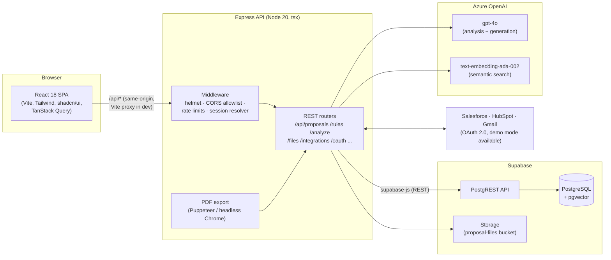

# DealSentry Architecture

DealSentry is an AI-assisted proposal compliance and risk review system. This
document explains how the pieces fit together and, more importantly, *why* —
including the trade-offs that were made deliberately.

## System overview



## Key design decisions

### 1. Two database access paths, on purpose

- **Runtime**: the Express API talks to Supabase over **PostgREST**
  (`supabase-js`). No connection pool to manage, works on serverless-ish free
  tiers, and survives the API host and database being in different regions.
- **Schema & seeds**: **Prisma** is used *only* for `db push`, `db execute`
  (the manual SQL in `prisma/manual/`) and `npm run seed`, over the Supabase
  **session-mode pooler** (port 5432 — Prisma migrations cannot run over the
  transaction pooler on 6543).

The trade-off: no compile-time query types at runtime (PostgREST returns
untyped JSON). That's the price of running well on a free tier; the routers
type their own row interfaces at the boundary instead.

### 2. Demo-first authentication

There is deliberately **no login screen**: every request is served as a default
user (`DEMO_USER_EMAIL`, falling back to the first ADMIN). The full JWT +
bcrypt stack still exists (`/api/auth/login`, `/register`,
`/change-password`) and valid bearer tokens win over the default identity, so
real multi-user auth can be re-enabled by rendering the login page again.

### 3. AI with guardrails, not AI instead of rules

`/api/analyze` sends the proposal *content* (source of truth) plus the active
compliance rules to gpt-4o and asks for structured findings. Hard limits
(max 25% discount, 90-day payment terms, mandatory legal clauses, $10k minimum
deal) are enforced twice: stated in the prompt *and* re-checked/capped in
code after generation (`/api/proposals/generate` clamps the discount range).
Results are normalized (`normalizeAnalysis`) before they become a RiskReport.

### 4. Semantic search via pgvector

Every proposal gets a 1536-dim embedding on create (best-effort — failures
never block the write). Search calls the `match_proposals` SQL function
(cosine distance, ivfflat index). If the extension/function is missing the API
answers `available: false` and the client falls back to substring search —
the feature degrades, it doesn't break.

Setup lives in `prisma/manual/semantic_search.sql`; backfill with
`npm run backfill:embeddings`.

### 5. Integrations with a real demo mode

Salesforce/HubSpot/Gmail connect over standard OAuth 2.0. With
`*_DEMO_MODE=true`, connect stores `{demo: true}` credentials and **sync
imports canned deals as proposals**, so the connect → sync → analyze → approve
story is demonstrable without any external accounts. Real-mode sync handles
token refresh and dedupes on the CRM record id.

### 6. Deployment (Render, Docker)

One container serves both the API and the built SPA (Express serves `dist/` in
production, so CORS is a non-issue for same-origin traffic). The runtime image
installs system Chromium for PDF export (`PUPPETEER_EXECUTABLE_PATH`), because
the free tier's 512 MB can't afford Puppeteer's bundled download at build time.
`render.yaml` is a full Blueprint — secrets are dashboard-only (`sync: false`).

## Security model (current state and roadmap)

| Area | Today | Next step |
| --- | --- | --- |
| API auth | Default-user demo mode; JWT honored when present | Re-enable login UI for multi-user |
| DB access | Server-side key via supabase-js; anon key works, service-role preferred when set | Enable RLS per table; drop anon write policies |
| Secrets | `.env` git-ignored; Render dashboard for prod | Rotate any key that was ever committed |
| Responses | Password hashes stripped from every user payload; mutations admin-gated | Field-level DTOs |

## Repository map

```
server.ts              Express bootstrap, static SPA serving, error handling
src/api/               One router per resource + middleware/ + lib/
src/lib/               API client (frontend), supabase client (backend), utils
src/pages/ components/ React SPA
prisma/                schema.prisma, seed.ts, manual/*.sql (pgvector, storage)
scripts/               backfill-embeddings, cleanup-integrations, migrate-auth
tests/                 Vitest + Supertest API tests
```
